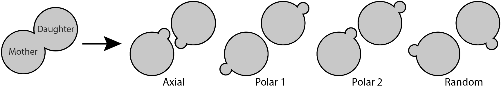
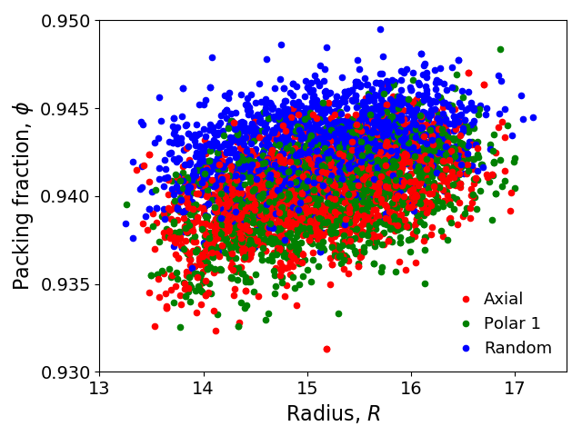
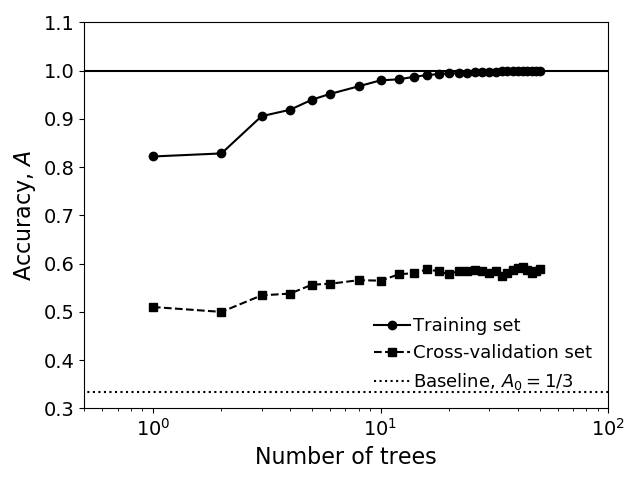
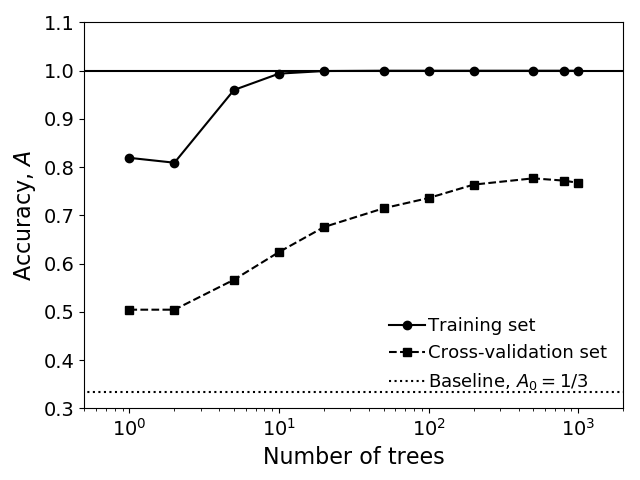
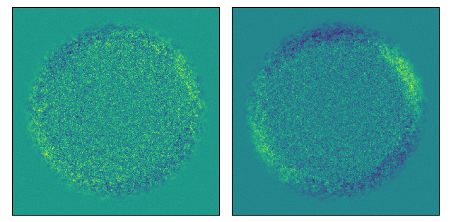
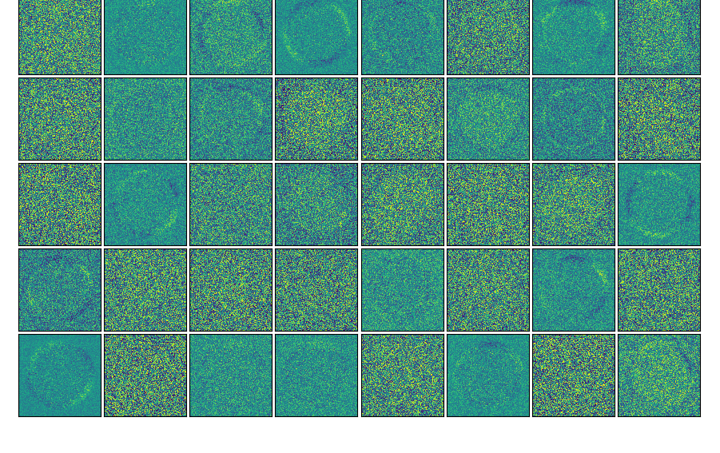

```{r setup, include=FALSE}
library(knitr)
opts_chunk$set(echo = FALSE,
               fig.align = "center")
```

One of the most time-consuming steps involved in performing a genetic screen is selecting for the desired phenotype. Here, I decsribe a fast and inexpensive machine learning protocol for genetic screening in which phenotype is inferred from spatial population structure. 

Even in a model organism as simple as yeast, scanning through thousands of colonies can require massive manpower, sophisticated image analysis tools, and a suite of automation. No matter how the phenotype manifests, whether in an easily-screened assay like expression/repression of a fluorescent reporter or in a more natural change in growth dynamics that may leave behind no readily-visible signature, we want to distinguish the phenotypes using as little data as possible. To highlight the value of machine learning in genetic screening, I use here bud-site selection ${\it S. cerevisiae}$ (budding yeast) mutants—where the final cell morphology is normal (i.e. round), but the dynamics of growth differ (whether buds form axially or bipolarly or neither, see Fig.\hspace{.4ex}\ref{bud_schematic}). In this case, I’ve chosen single timepoint images of each colony so that timelapse movies are not required. Industrial applications often wish to identify hybrid strains, generated by mixing two haploid strains. Hybrid strains, in contrast to their parents, are diploid and therefore bud using a polar program.

```{r fig1, fig.pos='ht', out.width="76%", fig.cap='\\label{bud_schematic}Bud-site selection in budding yeast. Daughter "buds" grow until mother and daughter split and each form new buds. Axial budding occurs in haploid cells, polar budding in diploid cells, and random budding in Rsr1 mutants.'}
library(knitr)

```

To test our protocol, I created thousands of budding cell colonies using physics-based computational simulations. These simulated colonies are innoculated with a single cell and expand outward as cells grow and push their neighbors. In order to mimic how S. cerevisiae colonies grow in the lab, I constrain growth to 2D (as if colonies are growing on flat plate) and restrict cellular growth to a region near the colony edge (as if nutrients are diffusing in from outside the colony). Fig.\hspace{.4ex}\ref{example_colonies} shows two example colonies from each budding type.

```{r fig2, fig.pos='ht', fig.show='hold', out.width="22.53%", fig.cap='\\label{example_colonies}Examples colonies compoased of (left to right columns): axial, polar 1, polar 2, and random types.'}
library(knitr)
include_graphics(c("figures/axial/frame1.png","figures/polar1/frame1.png","figures/polar2/frame1.png","figures/random/frame1.png",
                   "figures/axial/frame2.png","figures/polar1/frame2.png","figures/polar2/frame2.png","figures/random/frame2.png"))
```

Our goal is, from these images alone, to develop an algorithm to distinguish which budding type corresponds to which colony. It is not clear whether we can succeed since the colonies shown in Fig.\hspace{.4ex}\ref{example_colonies} are difficult to distiguish even by eye, but such a protocol could be a very powerful method for phenotypic screening. 

To train my model, I simulated $2400$ colonies for each budding type. I use axial, polar 1, and random types to train and test my model, and polar 2 as a seperate test case. These three training/testing types have a total of $3\times 2400=7200$ images which are randomly sorted and assigned as training ($5040$ images), cross-validation ($1080$ images), and testing ($1080$ images). Since I perform training on three budding types, a poor-performing learning model that randomly assigns each colony a label would have an accuracy (fraction of colony classified correctly) of around $A_0=1/3$, which is the baseline accuracy that I will compare my models to. 

```{r fig3, fig.pos='ht', fig.show='hold', out.width="51.7%", fig.cap='\\label{R_phi}Colony radii (in units of mother cell widths) and packing fractions measured from colony images for three budding types. Data is shown for the training data set, which has has $5040$ colony images in total.'}
library(knitr)

```

To get a feeling for the differences between budding types, I first measure rough physical characteristics from colony images: the colony radius $R$ and ``packing fraction'' $\phi$ (fraction of colony occupied by cells). In Fig.\hspace{.4ex}\ref{R_phi}, I see similar variations in $R$ for different budding types (due to variation in initial cell size) but that random budding cells produce slightly denser (larger $\phi$) colonies. This isn't a whole lot to go on, but suggests that if we try a little harder we may find structural signatures that distinguish different budding types. 

```{r fig4, fig.pos='ht', fig.show='hold', out.width="55%", fig.cap='\\label{R_phi_reg}Accuracy (fraction of types classified correctly) as a function of number of trees for a random forest classifier (RandomForestClassifier from sklearn in Python) based on Fig. 3 data. I cite test values for $50$ trees.'}
library(knitr)

```

Before attempting to tackle more complex datasets, I train a classification model on the $R$/$\phi$ data in Fig.\hspace{.4ex}\ref{R_phi}, which I refer to as "model 1". Using a random forest classifier, I find that $>20$ trees is sufficient to ensure the cross-validate error is maximal (Fig.\hspace{.4ex}\ref{R_phi_reg}). The accuracy $A_1^{\rm test}=0.60$ for our test set is better than $A_0=1/3$, but still far from the ideal of $A=1$. To see how model 1 is failing, we look at the "confusion matrix":

\begin{table}[ht]
\centering
\begin{tabular}{|c|c|c|l|c|}
\cline{1-3}
\multicolumn{3}{|c|}{{\bf Predicted label}} \\ \cline{1-3}
{\it Axial} & {\it Polar 1} & {\it Random}                                    \\ \hline
   $0.54$   &    $0.30$     &    $0.15$    & {\it Axial}   &                  \\ \cline{1-4}
   $0.34$   &    $0.50$     &    $0.16$    & {\it Polar 1} & {\bf True label} \\ \cline{1-4}
   $0.11$   &    $0.12$     &    $0.77$    & {\it Random}  &                  \\ \hline
\end{tabular}
\caption{Normalized confusion matrix (fraction of true labels classified as predicted labels) for model 1.}
\end{table}

We see that random budding type colonies are indeed distinguished from the axial and polar 1 types, as $0.77$ of random colonies are predicted as such. However, as one may have guessed from Fig.\hspace{.4ex}\ref{R_phi}, axial and polar 1 budding types are misidentified nearly as often as they are properly classified.  

```{r fig5, fig.pos='ht', fig.show='hold', out.width="55%", fig.cap='\\label{image_RF}Accuracy (fraction of types classified correctly) as a function of number of trees for a Random Forest classifier based on colony images (Fig. 2). I cite test values for $1000$ trees.'}
library(knitr)

```

In order to improve upon model 1, I now build a model using the entire $480\times 480$ pixel images ("model 2"). The number of features per image increase from $2$ to $480^2=230400$ from model 1 to model 2. A random forest classifier, with $1000$ trees to maximize the cross validation accuracy (Fig.\hspace{.4ex}\ref{image_RF}), gives much better results ($A_2^{\rm test}=0.79$) than model 1. This improvement primarily stems from much better predictions of axial and polar 1 budding types, for which the fraction of correctly-classified colonies increases by $\approx 0.25$.

\begin{table}[ht!]
\centering
\begin{tabular}{|c|c|c|l|c|}
\cline{1-3}
\multicolumn{3}{|c|}{{\bf Predicted label}} \\ \cline{1-3}
{\it Axial} & {\it Polar 1} & {\it Random}                                    \\ \hline
   $0.69$   &    $0.17$     &    $0.14$    & {\it Axial}   &                  \\ \cline{1-4}
   $0.11$   &    $0.75$     &    $0.14$    & {\it Polar 1} & {\bf True label} \\ \cline{1-4}
   $0.05$   &    $0.01$     &    $0.94$    & {\it Random}  &                  \\ \hline
\end{tabular}
\caption{Normalized confusion matrix (fraction of true labels classified as predicted labels) for model 2.}
\end{table}

In order to further improve on model 2, I turn to neural networks. A small neural network with two hidden nodes ("model 3") and regularization paramter $\lambda=1$ yields similar results to model 2, with an accuracy of $A_3^{\rm test}=0.77$. Model 3 improves upon model 2 in some regards and worsens in others (see confusion matrix below), but it is suprising that model 3 works as well as it does given that the images in Fig.\hspace{.4ex}\ref{R_phi} are nearly indistinguishable by eye and that the neural network in model 2 uses only two hidden nodes.

\begin{table}[ht]
\centering
\begin{tabular}{|c|c|c|l|c|}
\cline{1-3}
\multicolumn{3}{|c|}{{\bf Predicted label}} \\ \cline{1-3}
{\it Axial} & {\it Polar 1} & {\it Random}                                    \\ \hline
   $0.77$   &    $0.14$     &    $0.08$    & {\it Axial}   &                  \\ \cline{1-4}
   $0.18$   &    $0.69$     &    $0.12$    & {\it Polar 1} & {\bf True label} \\ \cline{1-4}
   $0.14$   &    $0.01$     &    $0.85$    & {\it Random}  &                  \\ \hline
\end{tabular}
\caption{Normalized confusion matrix (fraction of true labels classified as predicted labels) for model 3.}
\end{table}

To get a feeling for why model 2 works so well, I show the two hidden parameters in Fig.\hspace{.4ex}\ref{params_model_2}. These parameters seem to be capturing spatial fluctuations in both colony radius $R$ and packing fraction $\phi$, whereas model 1 only considered mean values of $R$ and $\phi$.

```{r fig6, fig.pos='ht', fig.show='hold', out.width="98%", fig.cap='\\label{params_model_2}Neural network hidden nodes for model 2 with two hidden paramters and regularization paramter $\\lambda=1$.'}
library(knitr)

```

We can further improve on model 3 by adding more hidden layer nodes ("model 4"). Using 40 nodes and a regularization paramter $\lambda=1$ increases the accuracy to $A_4^{\rm test}=0.84$, stemming from improvements in all types with respect to model 3. Interestingly, model 4 does not acheive an accuracy for the random budding type as high as we have found for the random forest classifier ($0.94$ for model 2).

\begin{table}[ht]
\centering
\begin{tabular}{|c|c|c|l|c|}
\cline{1-3}
\multicolumn{3}{|c|}{{\bf Predicted label}} \\ \cline{1-3}
{\it Axial} & {\it Polar 1} & {\it Random}                                    \\ \hline
   $0.84$   &    $0.09$     &    $0.08$    & {\it Axial}   &                  \\ \cline{1-4}
   $0.10$   &    $0.80$     &    $0.10$    & {\it Polar 1} & {\bf True label} \\ \cline{1-4}
   $0.08$   &    $0.05$     &    $0.87$    & {\it Random}  &                  \\ \hline
\end{tabular}
\caption{Normalized confusion matrix (fraction of true labels classified as predicted labels) for model 4.}
\end{table}

Many of parameters of model 4 (Fig.\hspace{.4ex}\ref{params_model_3}) capture fluctations in $R$ and $\phi$ similar to those of model 2 (Fig.\hspace{.4ex}\ref{params_model_2}), athough other parameters do not have easily-discernable structure. It is not clear to me that model 4 (or even model 3) is has found the best parameter set since so many of the parameters lack structure, so the neural network models would benefit from careful regularization, different cost function minimization routines, or an entirely different network architecture.  

```{r fig7, fig.pos='ht', fig.show='hold', out.width="100%", fig.cap='\\label{params_model_3}Neural network hidden nodes for model 3 with 40 hidden paramters and regularization paramter $\\lambda=1$.'}
library(knitr)

```

To summarize what I have found, the growth of simulated budding cells in spatial settings produce phenotypic-depedent population-level patterns that allow us to determine (up to an accuracy of $0.84$ for model 4) which phenotype a cell colony is composed of. We can acheive this high degree of accuracy even though the colonies have no readily-visible distinguishing features to the naked eye. This method may provide both tremendous cost savings as it circumvents additional time consuming and expensive phenotypic screens. 
